<div align="center">

# 🛡️ Implementación de un Firewall de Nueva Generación (NGFW) con FortiGate VM


<br><br>

<a href="(https://youtu.be/vnZ9osxL90c)" target="_blank">
    
</a>

</div>

# 👨‍🎓 Información del Proyecto

| Campo | Información |
|--------|------------|
| Estudiante | Álvaro Smilk Báez Tavera |
| Matrícula | 2021-1150 |
| Asignatura | Seguridad en Redes |
| Profesor | Jonathan Esteban Rondon Corniel |
| Institución | Instituto Tecnológico de las Américas (ITLA) |
| Fecha | Julio 9 2026 |

---

# 📖 Descripción

En este laboratorio se implementó un **Firewall de Nueva Generación (NGFW)** utilizando **FortiGate VM** con el objetivo de proteger una red empresarial mediante políticas de seguridad, filtros web, control de aplicaciones, protección contra ataques DoS y firewall para aplicaciones web.

---

# 🎯 Objetivos

- Configurar un FortiGate como firewall perimetral.
- Proporcionar acceso a Internet mediante NAT.
- Implementar perfiles de seguridad.
- Bloquear dominios mediante DNS Filter.
- Filtrar navegación web mediante Web Filter.
- Controlar aplicaciones mediante Application Control.
- Proteger el servidor web utilizando Web Application Firewall.
- Detectar y mitigar ataques DoS.
- Registrar eventos de seguridad.

---

# 🖥️ Topología

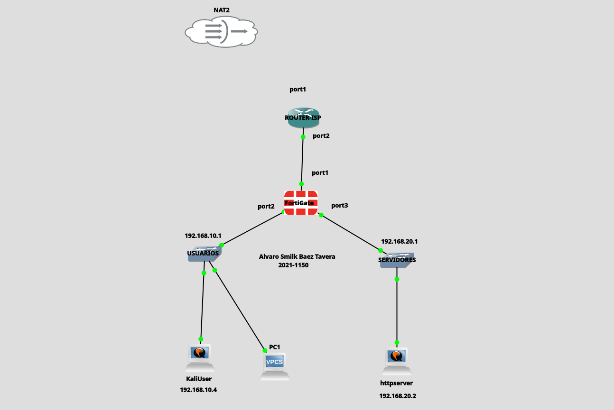

---

# 🌐 Plan de Direccionamiento

| Dispositivo | Interfaz | Dirección IP | Máscara |
|-------------|----------|--------------|----------|
| ISP Router | G0/0 | | |
| FortiGate | WAN | | |
| FortiGate | LAN Usuarios | | |
| FortiGate | LAN Servidores | | |
| Ubuntu Server | ens33 | | |
| Kali Linux | eth0 | | |

---

# ⚙️ Tecnologías Utilizadas

- FortiGate VM
- FortiOS
- Ubuntu Server
- Kali Linux
- Firefox
- HTTP
- DNS
- NAT
- WAF
- GNS3

---

# 🔧 Configuración Inicial

## Interfaces

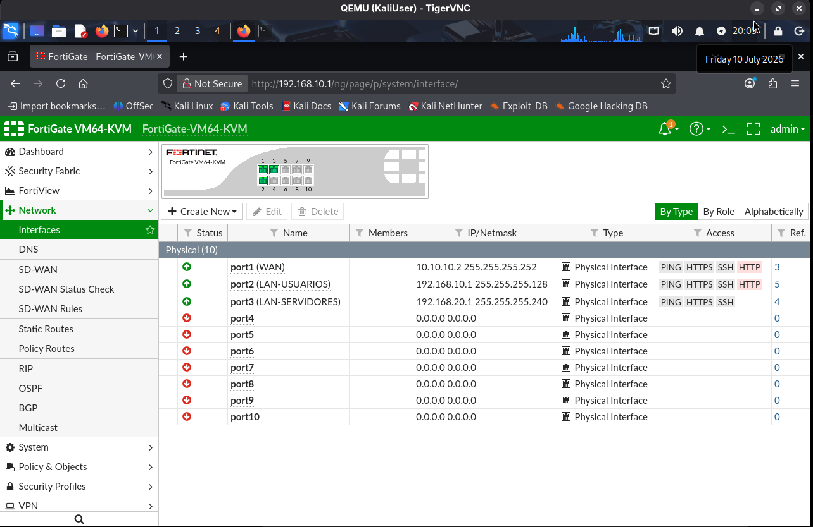

---

## Ruta por Defecto

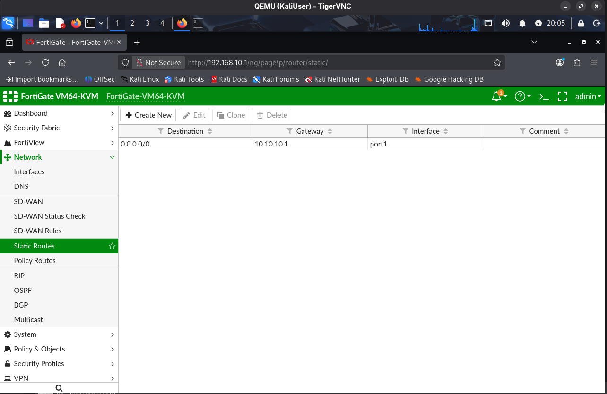

---

## Configuración NAT

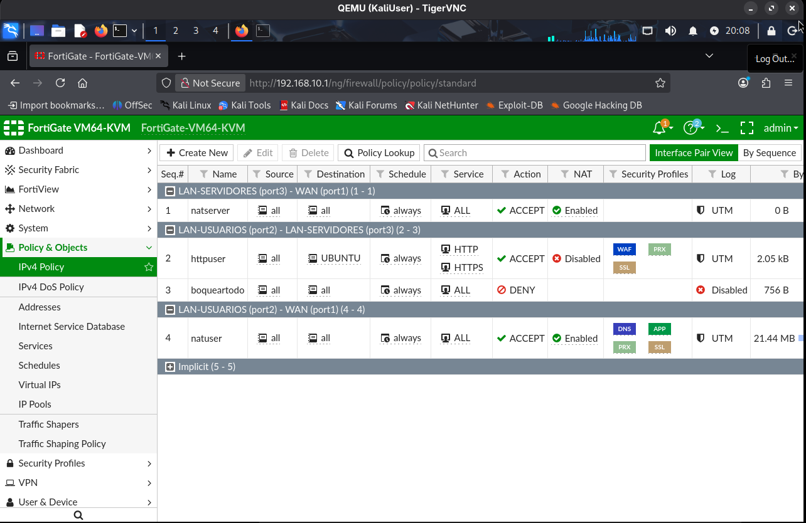

---

# 🔥 Políticas del Firewall

## Política 1 - LAN → Internet

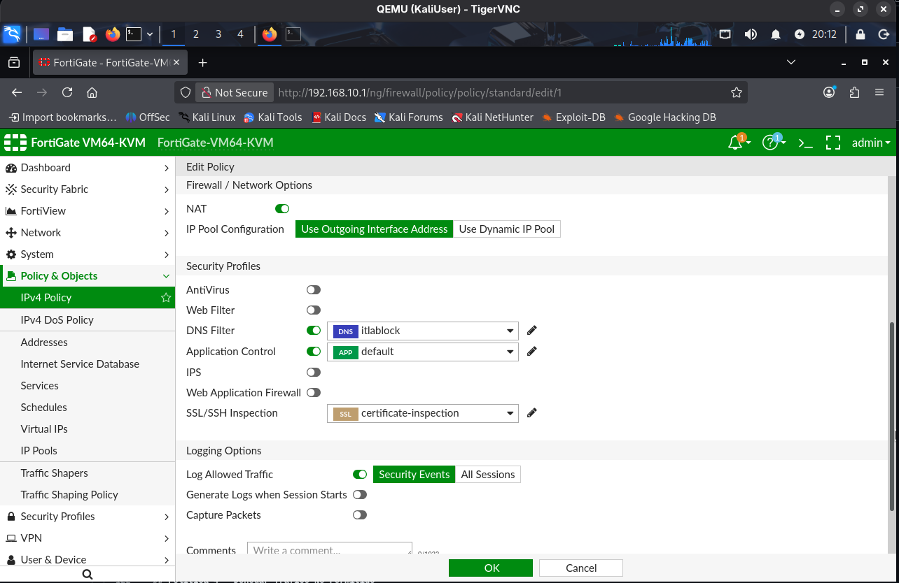

---

## Política 2 - Usuarios → Servidor Web

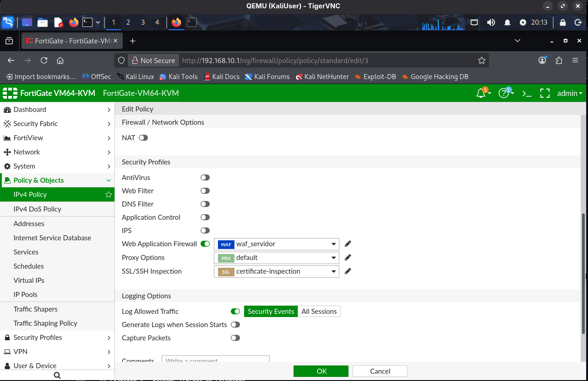

---

## Política 3 - Acceso Administrativo

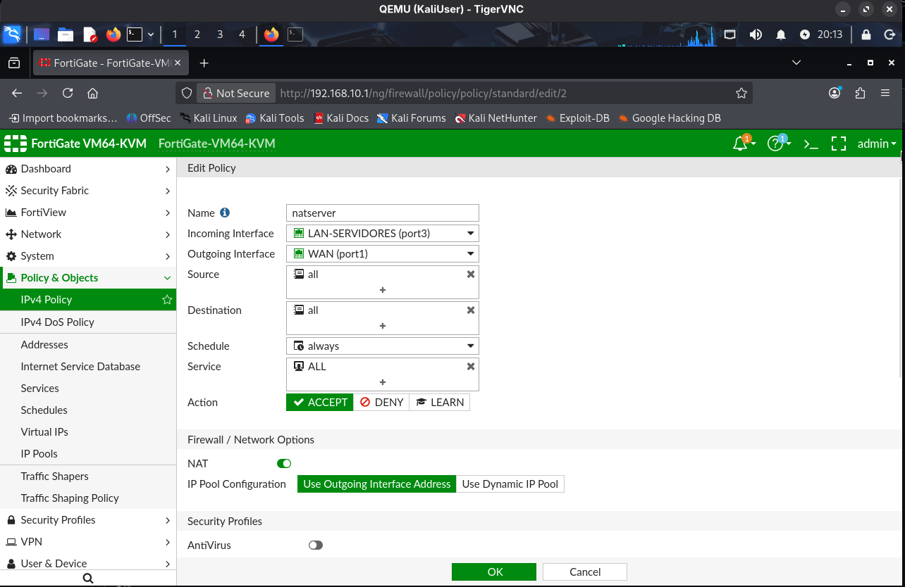

---

## Política 4 - Denegar Tráfico No Permitido

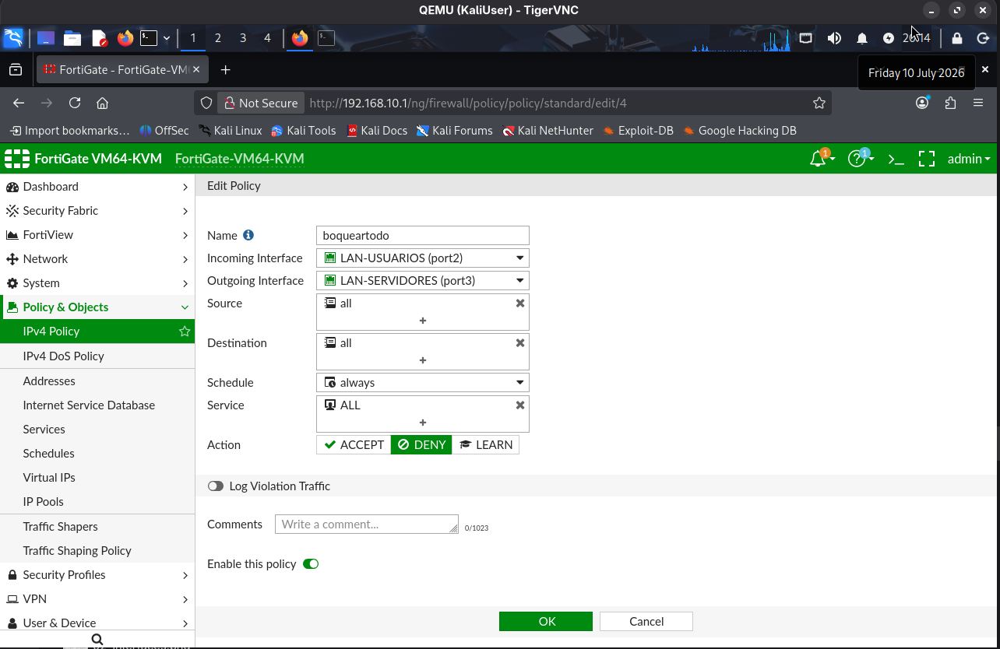

---

# 🌍 DNS Filter

## Configuración

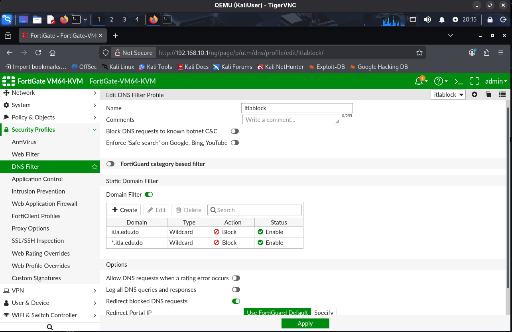

### Dominios bloqueados

- itla.edu.do
- *.itla.edu.do

---

# 🌐 Web Filter

## Configuración

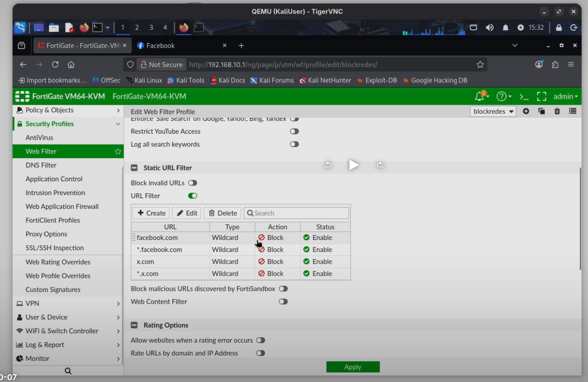

Categorías bloqueadas:

- Redes Sociales
- Web Chat
- Contenido no permitido

---

# 📱 Application Control

## Configuración

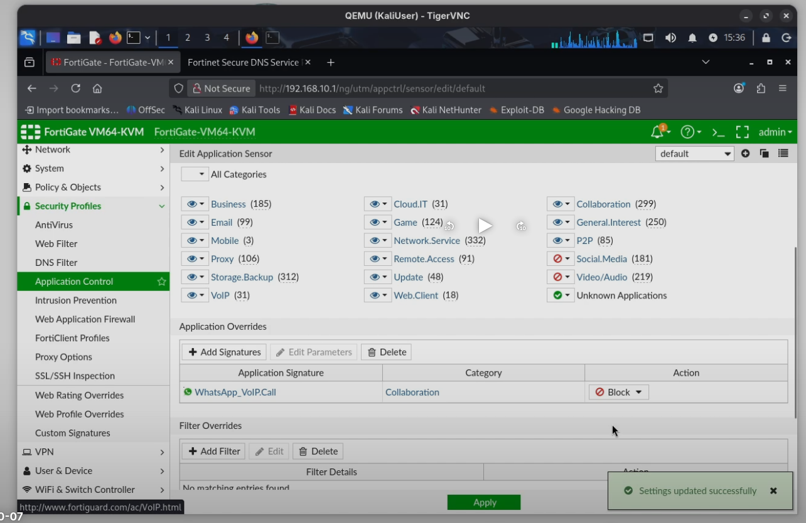

Aplicaciones controladas:

- Facebook
- Instagram
- TikTok
- WhatsApp
- YouTube

---

# 🛡️ Web Application Firewall (WAF)

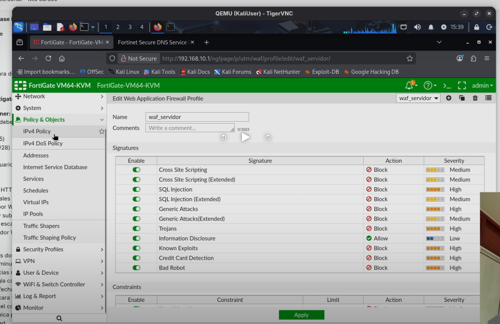

Protecciones implementadas:

- SQL Injection
- Cross Site Scripting (XSS)
- Restricciones HTTP
- Validación de encabezados
- Protección del servidor web

---

# 🚨 Política DoS

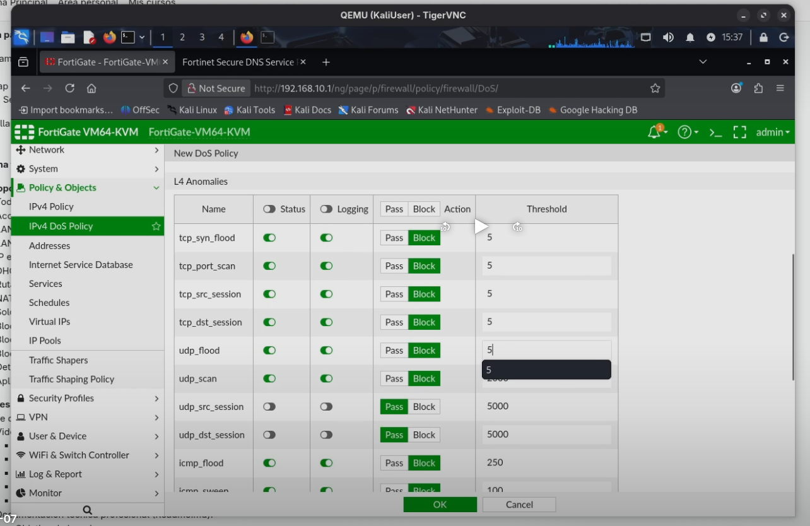

Protecciones habilitadas:

- TCP SYN Flood
- UDP Flood
- ICMP Flood
- Port Scan
- Flood Detection

---

## Eventos DoS

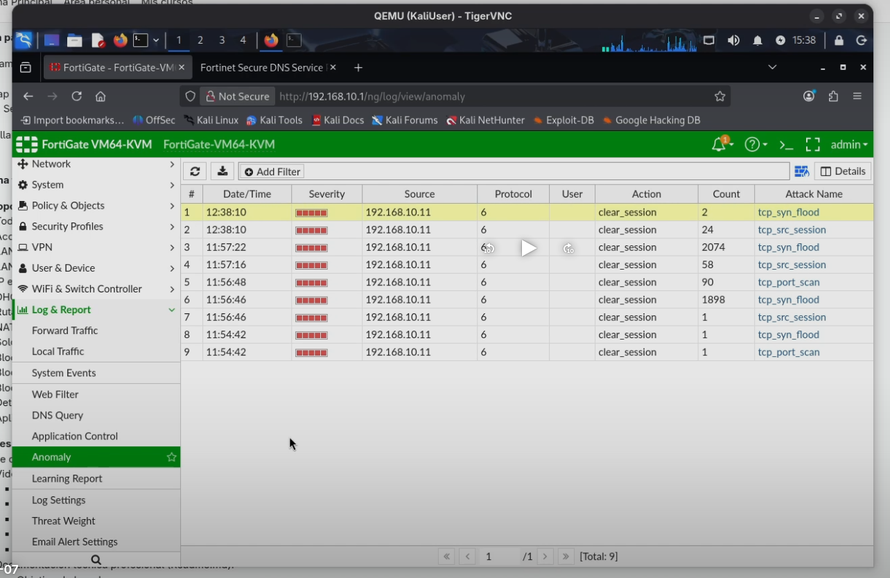

---

# ✅ Pruebas Realizadas

| Prueba | Resultado |
|---------|-----------|
| Acceso a Internet | ✅ |
| NAT | ✅ |
| Acceso HTTP al servidor | ✅ |
| Bloqueo de itla.edu.do | ✅ |
| Bloqueo mediante DNS Filter | ✅ |
| Protección WAF | ✅ |
| Protección DoS | ✅ |
| Registro de eventos | ✅ |

---

# 📚 Conocimientos Aplicados

- Seguridad Perimetral
- Firewalls de Nueva Generación (NGFW)
- NAT
- Web Application Firewall (WAF)
- DNS Filtering
- Web Filtering
- Application Control
- Protección DoS
- Hardening
- Registro y monitoreo de eventos

```

# 📖 Referencias

- Documentación oficial de Fortinet
- Guía de Administración de FortiOS
- Material de laboratorio del ITLA

---

# ⭐ Autor

**Álvaro Smilk Báez Tavera**

Instituto Tecnológico de las Américas (ITLA)

República Dominicana
